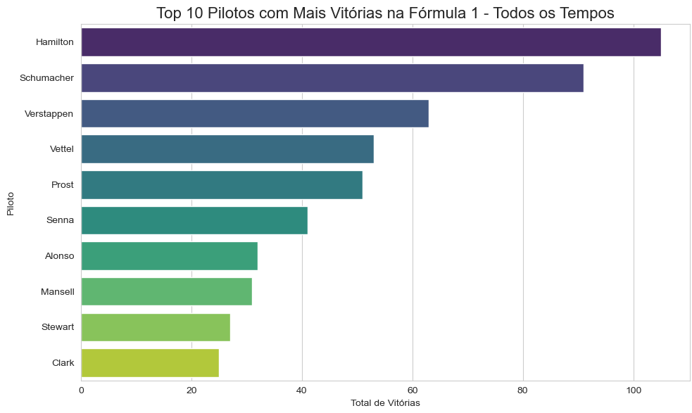

# 🏁 Análise F1: O melhor piloto tinha o melhor carro?

Projeto de análise de dados da Fórmula 1 para responder à pergunta:  
**"O melhor piloto só venceu porque tinha o melhor carro?"**

Utilizamos dados históricos da F1 para identificar:

- O piloto com mais vitórias por ano
- A equipe com mais vitórias por ano
- Se o melhor piloto estava ou não no melhor carro
- Os pilotos que se destacaram mesmo sem ter o melhor carro
- O ranking dos 10 pilotos com mais vitórias de todos os tempos

---

## 📌 Sobre o Projeto

- 📅 Dataset: [F1 Dataset do Kaggle](https://www.kaggle.com/datasets)
- 📍 Linguagem: Python (pandas, matplotlib, seaborn)
- 💻 Ferramenta: Jupyter Notebook
- 🎯 Objetivo: Explorar dados da F1 para analisar desempenho de pilotos vs equipes

---

## 🔎 Resultados

- Há vários anos em que o piloto mais vitorioso **não estava na equipe mais vitoriosa**
- Foram identificados os **anos em que o talento superou a máquina**
- Criado o **ranking dos 10 maiores vencedores da F1**

### 🧠 Conclusão

O carro importa, mas o piloto também.  
Alguns nomes se destacaram por vencer mesmo sem o melhor equipamento — e isso faz toda a diferença.

---

## 📊 Visualizações

- Gráfico de barras com os 10 pilotos mais vencedores
- Comparações por ano entre pilotos e construtores
- Ranking dos melhores pilotos

> Veja o notebook completo com os gráficos e insights.

---

## 📁 Estrutura
- Dados/ # Arquivos CSV do Kaggle
- Imagens/ # Gráficos gerados
- analise_formula1.ipynb # Jupyter Notebook com toda a análise
- README.md